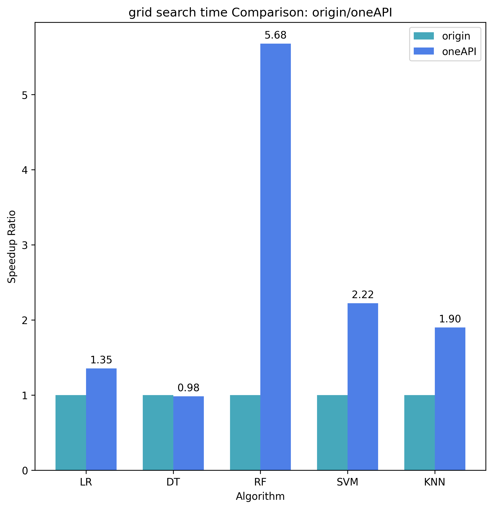

# oneAPI 加速课程作业

## 团队

成员：施鸿翔、李赛铁

## 问题陈述

2021 年，与信用卡欺诈相关的损失超过 120 亿美元，同比增长近 11%。就重大财务损失、信任和信誉而言，这是银行、客户和商户面临的一个令人担忧的问题。
电子商务相关欺诈一直在以约 13% 的复合年增长率 (CAGR) 增加。由于欺诈性信用卡交易急剧增加，在交易时检测欺诈行为对于帮助消费者和银行非常重要。机器学习可以通过训练信用卡交易模型，然后使用这些模型更快、更准确地检测欺诈交易，在预测欺诈方面发挥至关重要的作用。
预期解决方案：
       我们期待您参考英特尔的类似实现方案，基于我们提供的信用卡交易数据，训练一个或多个机器学习模型，有效预测信用卡交易是否为欺诈交易——这里推理时间和二分类准确度（F1分数）将作为评分的主要依据。

数据集  https://filerepo.idzcn.com/dataset/assignment_1.zip
链接：https://pan.baidu.com/s/1KNdSIwQHiDrJLT-5K-sPmA 提取码：fly8 

* 需要使用[英特尔®oneAPI AI分析工具包](https://www.intel.com/content/www/us/en/developer/tools/oneapi/ai-analytics-toolkit.html#gs.icozil)中数据分析和机器学习相关的优化库，可以跟官方的机器学习库进行性能对比
* 使用与[信用卡交易欺诈检测(https://github.com/oneapi-src/credit-card-fraud-detection)]参考套件中不同的算法实现
* 可以尝试使用多种算法进行比较

参考资料：
[信用卡交易欺诈检测，预测电线杆的健康状况和故障概率](https://github.com/oneapi-src/credit-card-fraud-detection)
[预测电线杆的健康状况和故障概率](https://github.com/idz-cn/2023hackathon/blob/main/machine-learning-track/ML-Hackathon-Demo.ipynb)

## 项目简介

本项目的主要目的在于,基于上述给出的问题背景，分析英特尔®oneAPI AI分析工具包对机器学习模型训练、推理的加速效果，和训练后模型性能的提升。

### 主要实现方案

1. 本项目使用多种算法和模型，有如下：
   * 逻辑回归
   * 决策树
   * 随机森林
   * SVM
   * KNN

2. 项目首先使用原始的机器学习库训练这5种模型，然后使用oneAPI加速的机器学习库再次训练这5种模型。对于原始机器学习库训练得到的模型，和oneAPI加速机器学习库训练得到的模型，比较如下指标：
   * 网格搜索时间
   * 训练时间
   * 推理时间
   * AUPRC
   * F1 score
   * precision
   * recall

3. 考虑到数据集中正类和负类样本极度不平衡，项目还采用了两种实现方案
   * 方案一：直接使用对原始数据集分割得到的训练集和测试集，进行训练和推理，不做重采样。模型全部使用默认参数，不做网格搜索来优化参数。代码和结果在`card-fraud-detection-full.ipynb`
   * 方案二：对数据集使用下采样，从原始数据集随机抽取部分的负类样本，和全部的正类样本组成训练集，生成的训练集中正负样本比列是1:9，使用这个新的训练集训练并且对模型使用网格搜索优化参数。在推理时则是使用原始数据集的全部数据。代码和结果在`card-fraud-detection-resample.ipynb`

### 技术栈

* 代码的运行结果均为在Intel® DevCloud for oneAPI的JupyerLab平台上运行得到
* 使用了Intel® oneAPI AI Analytics Toolkit

### 结果分析

运行结果的详情和模型的性能指标，可查看对应的notebook文件，以下分析聚焦于加速性能。

#### 方案一时间

训练时间（单位：秒）

|                     |      原始 |     加速 |
| ------------------- | --------: | -------: |
| Logistic Regression |    1.2786 |   0.3376 |
| Decision Tree       |   17.7058 |  13.1761 |
| Random Forest       |  186.4177 |   0.9155 |
| SVM                 | 1202.9603 | 493.4488 |
| KNN                 |    0.0581 |   0.0593 |

推理时间比较（单位：秒）

|                     |    原始 |   加速 |
| ------------------- | ------: | -----: |
| Logistic Regression |  0.0205 | 0.0071 |
| Decision Tree       |  0.0221 | 0.0144 |
| Random Forest       |  0.6041 | 0.0999 |
| SVM                 |  0.6038 | 0.1066 |
| KNN                 | 11.0209 | 3.8662 |

#### 方案二时间

训练时间比较（单位秒）

|                     |   原始 |   加速 |
| ------------------- | -----: | -----: |
| Logistic Regression | 0.0243 | 0.0126 |
| Decision Tree       | 0.0959 | 0.0968 |
| Random Forest       | 2.0796 | 0.2711 |
| SVM                 | 0.4233 | 0.4196 |
| KNN                 | 0.0019 | 0.0039 |

推理时间比较（单位：秒）

|                     |   原始 |   加速 |
| ------------------- | -----: | -----: |
| Logistic Regression | 0.0501 | 0.2922 |
| Decision Tree       | 0.0551 | 0.0491 |
| Random Forest       | 1.4327 | 0.2922 |
| SVM                 | 1.4401 | 0.2922 |
| KNN                 | 1.1088 | 0.2955 |

网格搜索时间比较（单位：秒）

|                     |     原始 |     加速 |
| ------------------- | -------: | -------: |
| Logistic Regression |   7.2731 |   5.3678 |
| Decision Tree       | 160.0968 | 162.6754 |
| Random Forest       | 721.3496 | 127.0862 |
| SVM                 |  90.7146 |  40.7990 |
| KNN                 |   1.0625 |   0.5592 |

#### 方案一/二 模型指标比较

选取指标均来自使用加速训练的模型

auprc

|                     | 方案一 | 方案二 |
| ------------------- | -----: | -----: |
| Logistic Regression | 0.7694 | 0.7472 |
| Decision Tree       | 0.5424 | 0.3501 |
| Random Forest       | 0.8472 | 0.8467 |
| SVM                 | 0.8129 | 0.7460 |
| KNN                 | 0.7650 | 0.6550 |

F1 score

|                     | 方案一 | 方案二 |
| ------------------- | -----: | -----: |
| Logistic Regression | 0.7277 | 0.5847 |
| Decision Tree       | 0.7360 | 0.4957 |
| Random Forest       | 0.8428 | 0.7069 |
| SVM                 | 0.8428 | 0.7069 |
| KNN                 | 0.7991 | 0.5957 |

precision

|                     | 方案一 | 方案二 |
| ------------------- | -----: | -----: |
| Logistic Regression | 0.8935 | 0.4429 |
| Decision Tree       | 0.7532 | 0.3441 |
| Random Forest       | 0.9585 | 0.5583 |
| SVM                 | 0.9585 | 0.5583 |
| KNN                 | 0.8861 | 0.4513 |

recall

|                     | 方案一 | 方案二 |
| ------------------- | -----: | -----: |
| Logistic Regression | 0.6138 | 0.8598 |
| Decision Tree       | 0.7195 | 0.8862 |
| Random Forest       | 0.7520 | 0.9634 |
| SVM                 | 0.7520 | 0.9634 |
| KNN                 | 0.7276 | 0.8760 |

#### 总结

1. 使用的数据量越大， AI Analytics Toolkit加速效果越明显。方案一的训练时间加速比为2-3倍，极端情况下随机森林的训练加速比甚至达到200倍！推理时间的加速比平均也有3-5倍
2. 方案二，由于训练使用的数据量比较少（只有4000条）训练的加速效果并不明显。但是推理速度的加速和网格搜索加速比效果，也是显著的。
3. 比较两种方案得到的模型性能指标，发现方案一的AUPRC、F1分数要高于方案二（重采样），precision指标远远超过方案二，但是recall指标低于方案二。
   推测原因可能是：
   方案二的正负样本比较平衡，所以训练中能比较好的记住正样本的特征，不会被过多的负样本特征覆盖，所以recall指标比较好。
   但同时方案二负样本的数量太少（只有4000多条，相比之下原始数据集有280000条数据），不能全面的学习负样本特征，常常把负样本误判为正样本，所以precision指标比较差。

## 团队收获

1. oneAPI  AI Analytics Toolkit的加速机器学习工作流的效果是显著的。并且DevCloud jupyter notebook平台提供的计算资源也对我们有极大的帮助。以后在学习，科研和生产使用AI Analytics Toolkit可以大大提高效率。